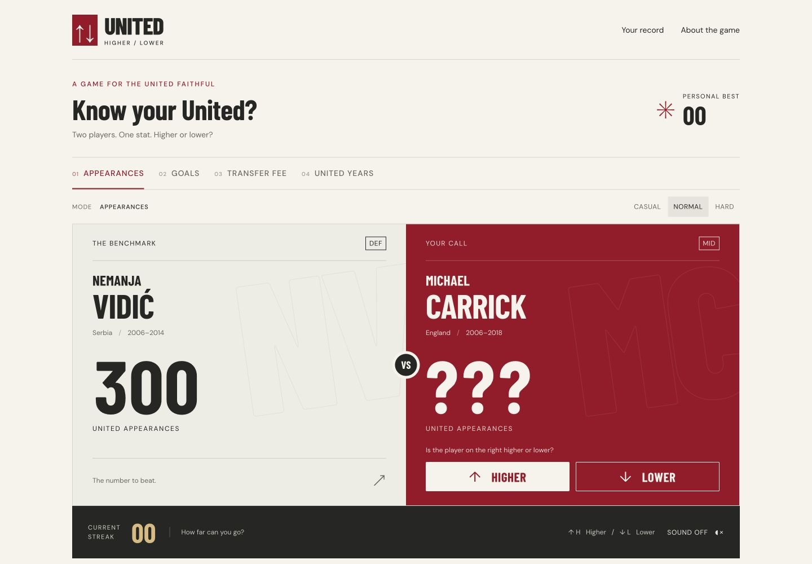

# United Higher / Lower

A complete, unofficial single-player football game for Manchester United fans. Open the home page and play: compare the challenger with the benchmark, choose higher or lower, and build a streak.

> Unofficial fan project. Not affiliated with Manchester United Football Club.

<!-- Screenshot placeholder: replace with an updated release screenshot when publishing. -->



## Features

- Four game modes; 54 curated player records across historical and modern eras.
- Three difficulties, with normal as the default. Hard favours closer values.
- Chained rounds: the previous challenger becomes the benchmark.
- Recent-player and unordered-pair history; ties and invalid values never become questions.
- 1.2-second answer reveal, correct feedback, final score, immediate restart and last-question review.
- Per-mode personal bests, lifetime games/questions/correct answers/accuracy, preferred mode and sound preference in localStorage.
- Safe fallback when storage is blocked, full or corrupt. No accounts, backend, analytics or secrets.
- Keyboard play, visible focus, live feedback announcements and reduced-motion support.
- Copy-result text with a selectable-text fallback when Clipboard API is unavailable or denied.
- Local, quiet, synthesized feedback WAVs; sound is off by default and only plays on a user answer.
- Original typographic player posters. Optional local player images fall back gracefully on load errors.
- `/stats`, `/about`, a custom 404, favicon, Open Graph image/metadata, sitemap, robots and manifest.

## Game modes

| Mode         | Eligible data                                       | Display    |
| ------------ | --------------------------------------------------- | ---------- |
| Appearances  | Nonnegative, finite competitive first-team totals   | `559`      |
| Goals        | At least 20 goals, excluding goalkeepers            | `253`      |
| Transfer fee | Positive, documented GBP arrival value              | `£30.75m`  |
| United years | Explicit, curated approximate senior-spell duration | `13 years` |

The first visit defaults to appearances. Later visits restore the saved mode. Changing mode or difficulty abandons the current streak and generates a new game. Best streaks are separated by mode, not difficulty.

## Tech stack

- Next.js 16.3.7 (latest stable reported by npm at implementation), App Router
- React 19.3, TypeScript, Tailwind CSS 4, ESLint
- npm lockfile for reproducible installs
- Barlow Condensed and DM Sans, bundled locally with Fontsource; no Google Fonts request
- Node's built-in test runner through `tsx`; no large UI or animation libraries

Use Node 22 or newer. Node 24 LTS is recommended for hosting.

## Run locally

```sh
npm install
npm run dev
```

Open [localhost:3000](http://localhost:3000). No `.env` is needed. You can change ports with `npm run dev -- --port 3001`.

## Build and check

```sh
npm run lint
npm test
npm run build
npm run start
```

`npm run typecheck` is also available (run the build once first to generate Next types). The production build prerenders all pages. `next start` serves the production output; development and production can run on different ports.

Tests cover higher/lower/equal comparisons, missing/invalid values, equality and same-player prevention, depleted candidate pools, mode eligibility, return-spell durations, difficulty selection, 3,000 chained rounds across all modes/difficulties, wrong-answer transitions, record parsing/persistence failures, scoring and share formatting.

## Deployment to GitHub Pages

This project is exported as static HTML and deployed by `.github/workflows/deploy.yml` when changes are pushed to `main`. The repository must use **GitHub Actions** as its Pages source. The deployment URL is <https://brandonwilliams33.github.io/united-higher-lower/>.

The workflow builds with the project base path and public site URL, runs lint and tests, then publishes the `out` directory. There is no backend, database, API key or user-created secret. For local development, `npm run dev` continues to use the root path. To reproduce the production export locally, run:

```sh
GITHUB_PAGES=true NEXT_PUBLIC_SITE_URL=https://brandonwilliams33.github.io/united-higher-lower npm run build
```

If the repository name or GitHub account changes, update the base path in `next.config.ts`, site URL in the deployment workflow, repository link in `src/app/about/page.tsx`, and this section. Verify the home page, `/stats/`, `/about/`, `robots.txt`, `sitemap.xml`, `manifest.webmanifest`, Open Graph image, and 404 page after deployment.

The player data still has the editorial review items listed under **DATA TODO** below; the game labels its statistics as curated and provides source links.

## Project structure

```text
src/
  app/
    page.tsx                 # Server page, immediate game
    layout.tsx               # Shared shell, local fonts and metadata
    globals.css              # Responsive football-programme design
    stats/page.tsx
    about/page.tsx
    not-found.tsx
    icon.svg
    opengraph-image.tsx
    robots.ts
    sitemap.ts
    manifest.ts
  components/
    Game.tsx                 # Client flow, input and persistence
    PlayerPanel.tsx
    ModeSelector.tsx
    GameControls.tsx
    ScoreHeader.tsx
    GameOver.tsx
    Stats.tsx
    SiteHeader.tsx
    SiteFooter.tsx
  data/
    players.ts               # Curated records, per-player source references
    sources.ts               # Central source registry and review date
  lib/
    game-engine.ts           # Pure selection and state transitions
    storage.ts               # Versioned, validated local records
    format.ts                # All statistic/share formatting
    site.ts                  # Public origin and SEO copy
  types/
    player.ts
    game.ts
public/sounds/               # Original short WAV feedback
 tests/                      # Engine and storage tests
 docs/                       # Screenshots and validation notes
```

## Data model

`Player` has a stable ID, name, nationality, position, senior start/end years, optional appearances/goals/transfer fee/United years, optional local image, eras, source IDs and optional data notes. Optional means unknown or intentionally excluded, never zero by implication.

`unitedEndYear: null` means the end year has **not been verified in this seed**, not a statement that the player remains at United. Such records display “Joined YEAR” and are excluded from United years unless an explicit reviewed duration exists.

Add a record in `src/data/players.ts`, add any new reference to `src/data/sources.ts`, and link it using `sourceIds`. Do not insert zeros to fill gaps. Keep values numeric; formatting belongs to `src/lib/format.ts`. Do not use live network calls in the game engine.

### Data sources / definitions

Statistics are curated for gameplay and should be verified against the referenced sources before production publication.

- **Appearances:** Manchester United men's first-team competitive appearances in all competitions, including Charity/Community Shield. Excludes friendlies, wartime games and abandoned competitions as described in the reference table.
- **Goals:** Same competition scope as appearances. Goals mode filters low scoring players for gameplay; it does not alter the statistics.
- **Transfer fees:** Reported initial or commonly cited transfer value in GBP, normalized for gameplay. No inflation adjustment. Historical reports may give packages including add-ons or player exchanges. This pool uses explicitly recorded published figures, not an assertion of identical accounting treatment. Pogba is the 2016 return fee only; Cole's £7m includes the exchange valuation; Carrick's £18.6m is the commonly cited package. Fields without a sufficiently clear reference are omitted.
- **United years:** Precomputed `sum(endYear - startYear)` over the listed senior spells. It is an approximate calendar-year measure, **not season count**, not days under contract and not appearances-per-season. Loan periods within a spell are not subtracted. Ronaldo: 2003–2009 plus 2021–2022 = 7. Pogba: 2011–2012 plus 2016–2022 = 7. Hughes: 1983–1986 plus 1988–1995 = 10. Scholes: 1994–2011 plus 2012–2013 = 18. The intentionally coarse Scholes result illustrates why the UI says years, not seasons.

Initial references reviewed on 2026-09-29:

- [Historical competitive player table](https://en.wikipedia.org/wiki/List_of_Manchester_United_F.C._players)
- [Transfer record summary](https://en.wikipedia.org/wiki/List_of_Manchester_United_F.C._records_and_statistics#Transfers)
- [The Independent: Carrick and Berbatov fees](https://www.the-independent.com/sport/football/premier-league/manchester-united-tottenham-spurs-news-eric-dier-pochettino-mourinho-a8021606.html)
- [Cantona official profile](https://www.manutd.com/en/players-and-staff/detail/eric-cantona)
- [Official legends reference](https://www.manutd.com/en/players-and-staff/legends)

The seed is manually curated; there is no scraper, scheduled collection or live-statistics claim. Reference pages were consulted, but this is not a claim that every field has been independently audited against primary sources.

### DATA TODO

Before a public launch:

1. **Audit all 54 records against primary sources**, especially competition inclusion, exact spell boundaries and any historical-statistic discrepancies. Preserve the source IDs and record changes with dates.
2. **Eric Cantona:** appearances intentionally omitted because the club profile shows 182 while the historical competitive table shows 185. The table/profile agree on 82 goals; the article's prose displayed a conflicting 87 and was not used. Reconcile competition scope before adding appearances.
3. **Anthony Martial, Harry Maguire, Casemiro, Romelu Lukaku, Jadon Sancho and Antony:** fee-only entries. Appearance, goal and duration fields are intentionally omitted pending verified, dated totals and career boundaries. `null` end years are unknown, not current-status claims.
4. **Every fee-mode entry:** confirm the accounting convention. In particular, Cole's player exchange, Carrick's add-ons, Ferdinand's reported total, and Pogba's return transfer need explicit editorial acceptance. The compact mode describes these as reported fees.
5. **Ronaldo, Pogba, Hughes and Scholes:** confirm the documented approximation is the desired product rule. Do not replace the values with a single start-to-end span or label them “seasons”. Review loan-spanning records such as Nani and Hernández under the same policy.
6. **Other missing fees:** intentionally excluded. Do not infer fees for academy players, free transfers, loans or unknown transactions. Add more only with a reference.
7. Recent players such as Rashford, Bruno Fernandes, Shaw and Martínez are not in this historical-first pool yet. Add dated, reviewed snapshots before including them; do not use undated totals from example briefs.

See per-record `dataNote` fields for exceptions. Accurate data is an editorial launch step, not a reason to invent figures.

## Engine and storage behavior

Candidates must differ from the reference by ID and value. The last seven player IDs and twenty unordered pairings are avoided. If a small pool is exhausted, player recency relaxes before pair recency; equality and identity constraints never relax. Normal selects from the closest 70% of available candidates; hard uses the closest 25%; casual uses all candidates. Relative difference is `abs(a-b) / max(a,b,1)`.

A game is counted on its **first submitted answer**, including games abandoned by navigation or mode changes. Every answer is persisted immediately, along with any new best. Restarting without answering does not inflate games played. Accuracy on the result screen is for that run; `/stats` accuracy is lifetime accuracy in this browser. The current unfinished streak is intentionally not restored on refresh.

Storage key: `united-higher-lower:v1`. Invalid JSON, unsupported versions, invalid counters, blocked storage and quota errors cannot crash the game. Records are device/browser-local, with no cross-tab transactional guarantees or cloud sync. The stats page refreshes on storage events from another tab.

## Accessibility and performance

The game section is focusable. Shortcuts respond within that section only and skip links, text inputs, settings groups and modifier-key combinations. After an answer or restart, focus stays in the game. On game over, Play again receives focus. Buttons expose pressed/disabled states. Screen readers hear correct/wrong results and revealed values through one live region. Motion respects `prefers-reduced-motion`.

All route shells are server rendered. Interactive components are client islands. Player art uses type rather than remote photography. Fonts and sounds are local, and sound playback failure is non-blocking. No analytics, chart library, animation library, database client or UI framework is shipped. Lighthouse scores are not asserted without an actual Lighthouse run.

## Disclaimer

Unofficial fan project. Not affiliated with Manchester United Football Club.

Manchester United and player names identify the subject of the game. No official crest, kit artwork or player photos are bundled. If adding photography later, obtain appropriate permission, record attribution and use local optimized assets. The generated audio is original; bundled typefaces retain their Fontsource/OFL licensing.

## Roadmap

The best next feature is a **daily challenge** with a deterministic seed so friends can compare the same questions without a backend. Later possibilities:

- Historical match mode
- More verified statistics and eras
- Licensed player images
- Share cards
- Optional online leaderboard (would require a separate backend design)

These features are not included in V1.
